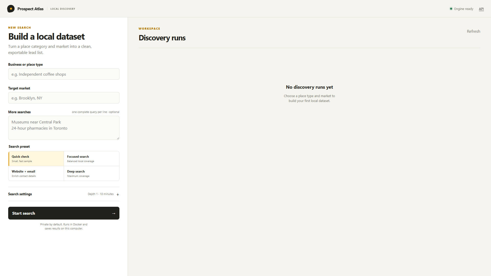

# Prospect Atlas

**A local-first Google Maps research workspace for building clean, actionable business datasets.**

Prospect Atlas turns a business category and location into a structured lead list. It combines a guided search workflow with live run status, automatic deduplication, lead-quality scoring, contact filters, and CSV/Excel exports—all running locally through Docker.

Prospect Atlas is my local-first business discovery and lead-research project.



## What it does

- Searches Google Maps by business type, service, venue, or place category
- Targets a city, ZIP code, neighborhood, region, or country
- Runs multiple related queries in one discovery job
- Collects business names, categories, addresses, phone numbers, websites, ratings, reviews, coordinates, and other available place data
- Optionally visits business websites to discover public email addresses
- Deduplicates overlapping results automatically
- Scores lead completeness and highlights missing contact information
- Filters, sorts, paginates, and customizes result columns
- Exports the current filtered view to CSV or Excel-compatible `.xls`
- Persists completed runs and result files locally
- Exposes a REST API at `/api/docs`

## Product workflow

1. Enter a business or place type.
2. Choose the target market.
3. Select a quick, focused, enriched, or deep search preset.
4. Monitor the run from the activity workspace.
5. Review, filter, and export the resulting dataset.

## Run locally on Windows

Requirements: [Docker Desktop](https://www.docker.com/products/docker-desktop/) with Linux containers enabled.

1. Clone or download this repository.
2. Double-click `Start Prospect Atlas.cmd`.
3. Open [http://localhost:8080](http://localhost:8080).
4. Use `Stop Prospect Atlas.cmd` when finished.

The first launch builds the local image. Search history and CSV files are stored in `gmapsdata/` and remain available between sessions.

### Docker command

```bash
docker build -t prospect-atlas .
docker run --rm -p 8080:8080 -v "${PWD}/gmapsdata:/gmapsdata" prospect-atlas -data-folder /gmapsdata
```

## Search presets

| Preset | Best for | Default behavior |
|---|---|---|
| Quick check | Validating a query | Depth 1, five-minute limit |
| Focused search | Normal local research | Balanced depth and runtime |
| Website + email | Contact enrichment | Visits public business websites |
| Deep search | Broader coverage | Higher depth and longer runtime |

Advanced settings expose depth, time limit, map zoom, language, radius, coordinates, fast mode, and proxy rotation without crowding the primary workflow.

## Architecture

```text
Browser dashboard
      │
      ▼
Go web server + REST API
      │
      ├── SQLite job state
      ├── CSV result storage
      └── Playwright-based Google Maps extraction
```

The interface is plain HTML, CSS, and JavaScript served by the Go application. Docker packages the Go service and browser runtime into a reproducible local environment.

## Quality and reliability

The repository includes Go tests for the scraper, grid generation, queueing, web service, API rendering, proxy configuration, and result writers. Before publishing changes, run:

```bash
go test ./...
```

The dashboard also handles unavailable-engine states, input validation, failed downloads, deletion confirmation, automatic polling, safe export filenames, and reduced-motion preferences.

## Responsible use

Use Prospect Atlas only for lawful research and collection of publicly available information. Respect applicable privacy laws, website terms, robots policies, and reasonable request rates. Large or repeated searches should use conservative concurrency and appropriate proxies.

## Open-source foundation

This project uses the MIT-licensed [gosom/google-maps-scraper](https://github.com/gosom/google-maps-scraper) open-source engine. Its license remains in [LICENSE](LICENSE), and the original documentation is preserved in [docs/UPSTREAM-README.md](docs/UPSTREAM-README.md).

## License

MIT. See [LICENSE](LICENSE).
